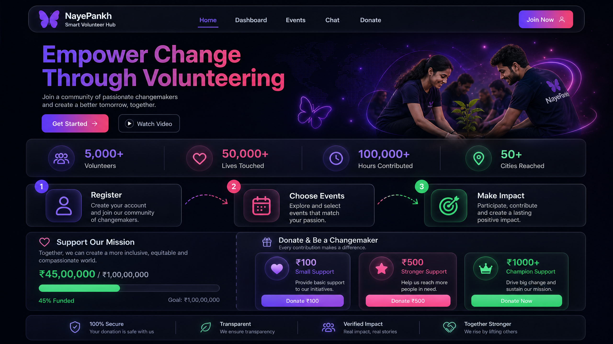
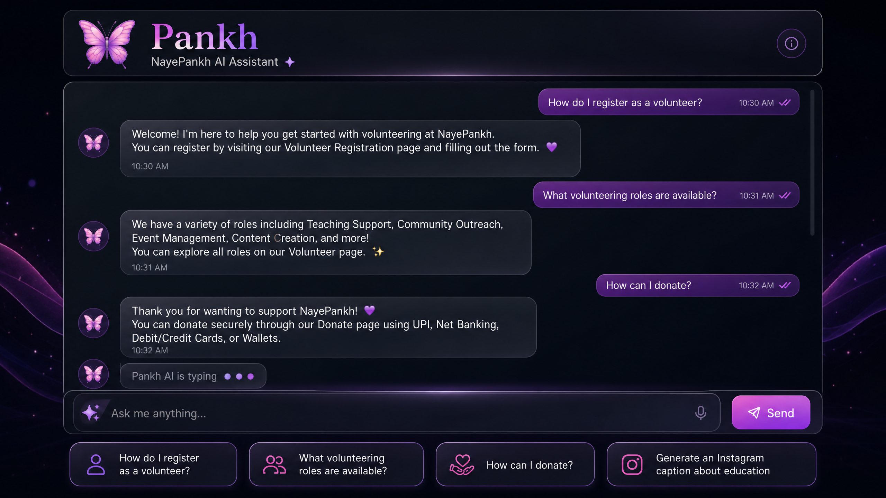
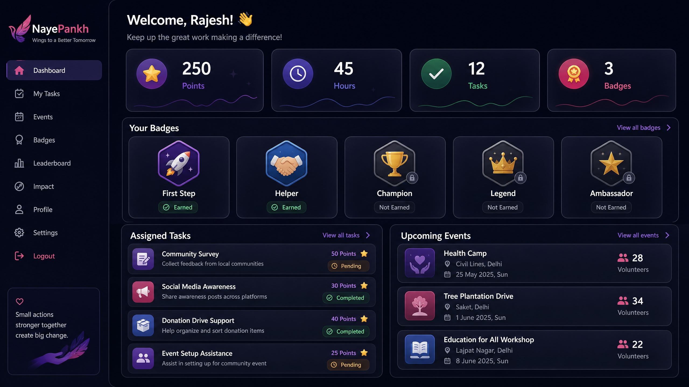
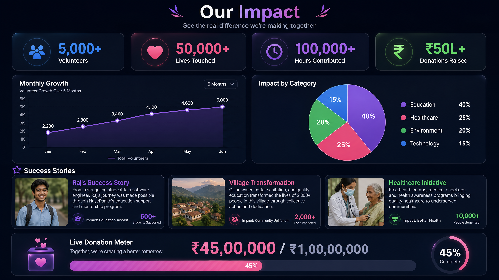
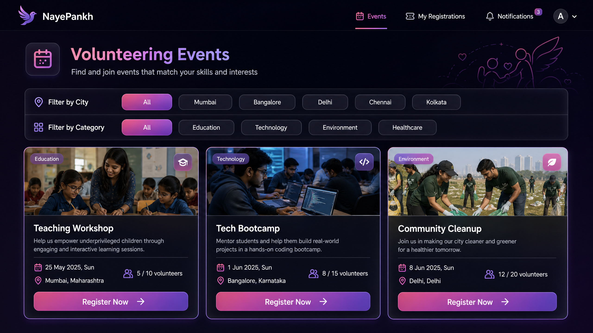

# 🦋 NayePankh Smart Volunteer Hub

[](LICENSE)
[](https://react.dev/)
[](https://nodejs.org/)
[](https://www.mongodb.com/)
[](https://tailwindcss.com/)
[](https://vercel.com/)

A modern, full-stack web platform for **NayePankh Foundation** - an NGO empowering underprivileged students and communities through volunteer efforts. This platform leverages AI to enhance engagement, transparency, and impact.

## 🎯 Project Overview

NayePankh Smart Volunteer Hub is a comprehensive digital ecosystem designed to streamline volunteer management and amplify community impact.

### 🏠 Landing Page


### Key Features:
- **🤖 AI-Powered Chatbot (Pankh)**: Intelligent assistant powered by Anthropic Claude API for instant support and guidance.
- **📊 Impact Analytics**: Real-time data visualization of lives touched, volunteers joined, and donations raised.
- **🎖️ Gamification System**: Earn points and badges (First Step, Helper, Champion, Legend, Ambassador) for contributions.
- **🎯 Event Management**: Discover and register for volunteering opportunities based on skills and location.
- **💰 Smart Donation Hub**: Transparent tracking of donation progress with impact-linked tiers.
- **👤 Volunteer Dashboard**: Personalized space to track hours, tasks, and achievements.
- **🛡️ Secure Auth**: Role-based access control with JWT and bcrypt protection.

## 📸 Screenshots

### 🤖 AI Chatbot (Pankh)


### 📊 Volunteer Dashboard


### 📈 Impact Dashboard


### 📅 Events Listing


## 🛠️ Tech Stack

| Layer | Technologies |
|-------|--------------|
| **Frontend** | React 19, Vite, Tailwind CSS v4, Framer Motion, Recharts |
| **Backend** | Node.js, Express.js, MongoDB, Mongoose |
| **AI Integration** | Anthropic Claude API |
| **Authentication** | JWT, Bcrypt.js |
| **Tools** | pnpm, Axios, Nodemailer, pdf-lib |

## 🚀 Deployment Guide

### 1. Frontend Deployment (Vercel)
1. Import this repository to [Vercel](https://vercel.com/).
2. Set **Root Directory** to `frontend`.
3. Add Environment Variable: `VITE_API_URL` = `https://your-backend-url.onrender.com/api`.
4. Click **Deploy**.

### 2. Backend Deployment (Render)
1. Create a "New Web Service" on [Render](https://render.com/).
2. Set **Root Directory** to `backend`.
3. Add environment variables from `.env.example`.
4. Click **Create Web Service**.

## 📁 Project Structure

```
nayepankh-volunteer-hub/
├── frontend/          # React + Vite + Tailwind v4
├── backend/           # Node + Express + MongoDB
├── screenshots/       # Project visual assets
├── LICENSE            # MIT License
├── CONTRIBUTING.md    # Contribution guidelines
└── .env.example       # Environment template
```

## 📝 License

This project is licensed under the MIT License - see the [LICENSE](LICENSE) file for details.

---
**Made with ❤️ for NayePankh Foundation**
